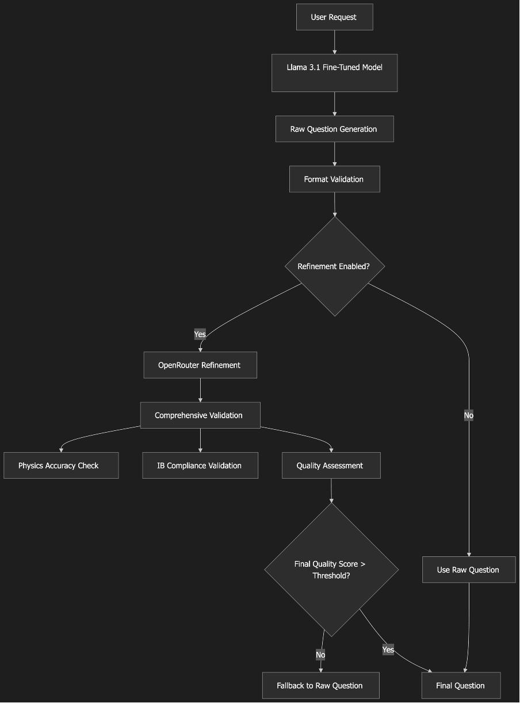

# 🎓 IB Physics Practice Generator

[](RELEASE_NOTES.md)
[](https://nextjs.org/)
[](https://www.typescriptlang.org/)
[](LICENSE.md)

**Never run out of physics practice questions again!** 🚀

This AI-powered tool creates unlimited, curriculum-aligned IB Physics questions instantly. Perfect for students cramming for exams, teachers preparing lessons, or anyone curious about educational AI.



## ✨ What Makes This Special?

### 🎯 **Built for IB Students**
- **Covers all 24 IB Physics topics** - From kinematics to quantum physics
- **Paper 1 style questions** - Multiple choice just like your exams
- **Free to use** - No subscriptions, no limits (with basic setup)
- **Works offline** - Demo mode needs no internet
- **Mobile friendly** - Study anywhere, anytime

### 🤖 **Powered by Smart AI**
- **Custom-trained model** - Learned from real IB Physics questions
- **Quality checking** - AI reviews every question for accuracy
- **Multiple AI options** - Free and premium choices available
- **Always improving** - Gets smarter with community feedback

### 🛠️ **Perfect for Learning**
- **Open source** - See how it works, improve it yourself
- **Modern tech stack** - Learn web development with Next.js
- **Real-world project** - Great for portfolios and learning
- **Welcoming community** - Help from students and educators

## 📋 Table of Contents

- [🚀 Quick Start](#-quick-start) - Get running in 5 minutes
- [📦 Setup Guide](#-setup-guide) - Step-by-step installation
- [💡 How to Use](#-how-to-use) - Generate your first question
- [🤝 Join the Community](#-join-the-community) - Help make it better
- [📚 Learn More](#-learn-more) - Detailed documentation

## 🚀 Quick Start

**Want to try it right now?** Here are your options:

### 🎯 Option 1: Instant Demo (No Setup!)
Just run the project - it includes demo questions to get you started:
```bash
git clone https://github.com/melonwer/ibphysiq.git
cd ibphysiq
npm install
npm run dev
```
Open [localhost:3000](http://localhost:3000) and start generating questions! 🎉

### 🆓 Option 2: Free AI Power (Recommended)
Get unlimited questions with free AI:
1. Get a free OpenRouter API key at [openrouter.ai](https://openrouter.ai) 🆓
2. Copy `.env.example` to `.env.local`
3. Add your key: `OPENROUTER_API_KEY=sk-or-your-key-here`
4. Start the app: `npm run dev`

**That's it!** You now have unlimited, AI-generated IB Physics questions. 🤯

### 👤 Option 3: Advanced Setup (Optional)
For developers and advanced users who want more AI options:

**Lightning AI (Custom Model)**
- Get 15 free credits for our custom IB Physics model
- More specialized for physics questions
- See [Lightning AI Guide](docs/DEPLOYMENT.md) for setup

**Google Gemini**
- Premium quality AI refinement
- Requires API key from [Google AI Studio](https://aistudio.google.com/)

**Local Models**
- Run everything on your computer
- Perfect for offline use or customization
- See our [Local Setup Notebook](notebooks/setup_local_model.ipynb) for details

> 💡 **Pro tip**: Start with Option 2 (free OpenRouter) - it's perfect for most students!

---

## 📦 Setup Guide

### What You Need
- **Node.js 20+** - [Download here](https://nodejs.org/)
- **Git** - For downloading the project
- **5 minutes** - That's it! ⏱️

### Step-by-Step Setup

```bash
# 1. Download the project
git clone https://github.com/melonwer/ibphysiq.git
cd ibphysiq

# 2. Install everything
npm install

# 3. Set up your environment (optional for demo)
cp .env.example .env.local
# Edit .env.local to add your API keys

# 4. Start the magic! ✨
npm run dev
```

**Open [localhost:3000](http://localhost:3000)** and you're ready to generate questions!

## 💡 How to Use

### 🖥️ Web Interface (Easy!)
1. **Open the app** at `localhost:3000`
2. **Pick your topic** from the dropdown (like "Kinematics" or "Waves")
3. **Choose difficulty** (Easy, Standard, or Hard)
4. **Click "Generate Question"** 🎲
5. **Study away!** Get explanations, try different topics

### ⚙️ Settings Panel
Visit `/settings` to configure:
- **OpenRouter** - Free AI (recommended!)
- **Google Gemini** - Premium AI refinement
- **Lightning AI** - Custom physics model
- **Local Models** - Run on your computer

### 🔧 For Developers
```bash
# Generate via API
curl -X POST "http://localhost:3000/api/generate-question" \
  -H "Content-Type: application/json" \
  -d '{
    "topic": "kinematics",
    "difficulty": "standard",
    "openRouterApiKey": "your-key-here"
  }'
```

## 🤝 Join the Community

### 🌟 How to Contribute
**Never contributed to open source?** Perfect! This is a great place to start:

1. **🍴 Fork the project** on GitHub
2. **🔧 Make improvements** (fix bugs, add features, improve docs)
3. **📤 Submit a pull request** - we'll help you through the process!

**Ideas for contributions:**
- Add new physics topics
- Improve question quality
- Make the UI more beautiful
- Write better documentation
- Fix bugs and typos

### 💬 Get Help & Connect
- **💬 Questions?** [GitHub Discussions](https://github.com/melonwer/ibphysiq/discussions)
- **🐛 Found a bug?** [Report it here](https://github.com/melonwer/ibphysiq/issues)
- **💡 Have ideas?** Share them in discussions!

## 📚 Learn More

### 📖 Documentation
- **[Getting Started Guide](docs/GETTING_STARTED.md)** - Friendly intro for newcomers
- **[API Reference](docs/API.md)** - Technical details for developers
- **[Deployment Guide](docs/DEPLOYMENT.md)** - How to deploy your own version
- **[Contributing Guide](docs/CONTRIBUTING_RELEASES.md)** - How to help improve the project

### 🛠️ Technical Details
Built with modern technologies:
- **Next.js 15** - React framework for web apps
- **TypeScript** - Better JavaScript with types
- **OpenRouter** - Free AI API access
- **Lightning AI** - Custom model hosting

## 📄 License

This project is MIT licensed - use it for anything! See [LICENSE](LICENSE) for details.

## 🙏 Acknowledgments

Huge thanks to:
- **OpenRouter** for free AI access 🆓❤️
- **Lightning AI** for model hosting ⚡❤️
- **IB Physics Community** for guidance and feedback 🎓❤️
- **All contributors** who make this better every day 🤝❤️

---

<p align="center">Made with ❤️ for IB Physics students and educators worldwide</p>
<p align="center">🌟 <strong>Star us on GitHub if this helps your studies!</strong> 🌟</p>
